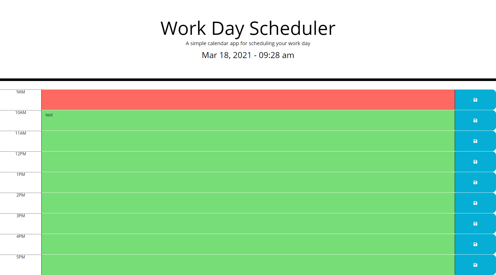

# 05-Third-Party-APIs-Work-Day-Scheduler

# Homework 5

## Description of my work:

* When opening the planner, the current date and time are displayed at the top of the page.

* There are color coded time blocks for business hours that indicate past, present and future hours. 

* An incorrect answer subtracts time from the timer.

* Clicking on a timebock allows the user to enter text.

* Clicking the corresponding save button, sends the text to local storage.

* When the page is refreshed, the saved text persists.

## Link to Website
https://rlacer.github.io/04-Web-API-CODE-QUIZ/

## Screenshot
